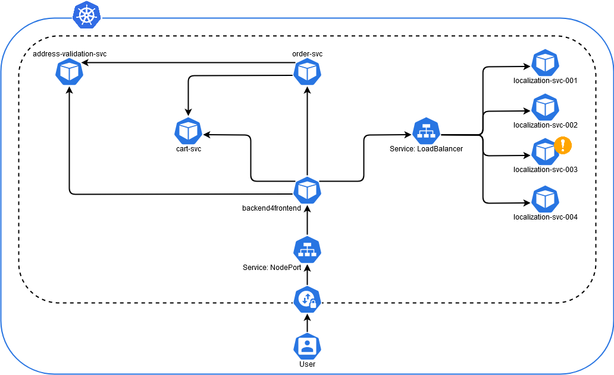

# Kubernetes Configuration

## **Complete** Deployment

Start

    kubectl apply -f localization-deployment.yaml
    kubectl apply -f address-validation-deployment.yaml
    kubectl apply -f cart-deployment.yaml
    kubectl apply -f order-deployment.yaml
    kubectl apply -f backend4frontend-deployment.yaml

Stop

    kubectl delete -f localization-deployment.yaml
    kubectl delete -f address-validation-deployment.yaml
    kubectl delete -f cart-deployment.yaml
    kubectl delete -f order-deployment.yaml
    kubectl delete -f backend4frontend-deployment.yaml

Quick&Dirty Log Check

    kubectl logs localization-svc-001
    kubectl logs localization-svc-002
    kubectl logs localization-svc-003
    kubectl logs localization-svc-004
    kubectl logs address-validation-svc
    kubectl logs cart-svc
    kubectl logs order-svc
    kubectl logs backend4frontend

## Jaeger

Start
    
    kubectl get ingress
    
    minikube service jaeger-ui-query

Create

    kubectl apply -f jaeger_instance.yaml

Delete

    kubectl delete -f jaeger_instance.yaml

## Elastic Cloud on Kubernetes

Create

    kubectl apply -f elastic_instance.yaml

Delete

    kubectl delete -f elastic_instance.yaml

Misc

    kubectl get elasticsearch
    kubectl get pods --selector='elasticsearch.k8s.elastic.co/cluster-name=quickstart'
    kubectl get service quickstart-es-http

## Splunk on Kubernetes

Create

    kubectl apply -f splunk-operator-install.yaml

Delete

    kubectl delete standalones --all
    kubectl delete licensemasters --all
    kubectl delete searchheadclusters --all
    kubectl delete clustermasters --all
    kubectl delete indexerclusters --all
    kubectl delete spark --all
    kubectl delete -f splunk-operator-install.yaml

### K8S Deployment Diagram

## Microservices

	localization-svc
	address-validation-svc
	cart-svc
	order-svc
	backend4frontend

## Misc Commands

### Kubernetes

    kubectl get services
    
    kubectl get deployments
    
    kubectl get pods --output=wide
    
    kubectl describe deployments localization-svc
    
    kubectl describe services localization-svc

Docker

    docker network inspect bridge
    
    docker ps

### Minikube

Start

    minikube start --cpus 4 --memory 16384
    minikube start --addons=ingress

Stop

    minikube stop

Start Services

    minikube service localization-svc
    minikube service address-validation-svc
    minikube service cart-svc
    minikube service order-svc
    minikube service backend4frontend

### Jaeger Initial Config

Create

    kubectl create -f jaeger_jaegertracing.io_jaegers_crd.yaml
    kubectl create -f jaeger_service_account.yaml
    kubectl create -f jaeger_role.yaml
    kubectl create -f jaeger_role_binding.yaml
    kubectl create -f jaeger_operator.yaml
    
    # Start Elastic Cloud first
    PASSWORD=$(kubectl get secret quickstart-es-elastic-user -o go-template='{{.data.elastic | base64decode}}')
    echo $PASSWORD
    kubectl create secret generic jaeger-secret --from-literal=ES_PASSWORD=$PASSWORD --from-literal=ES_USERNAME=elastic
    kubectl create -f jaeger_instance.yaml

Delete
    
    kubectl delete -f jaeger_instance.yaml
    kubectl delete secret generic jaeger-secret

    kubectl delete -f jaeger_jaegertracing.io_jaegers_crd.yaml
    kubectl delete -f jaeger_service_account.yaml
    kubectl delete -f jaeger_role.yaml
    kubectl delete -f jaeger_role_binding.yaml
    kubectl delete -f jaeger_operator.yaml

Misc

    kubectl rollout restart deployment/jaeger-operator

### Splunk Commands

	kubectl get secret splunk-default-secret -o yaml
	# get only admin password, decoded
	kubectl get secret splunk-default-secret -o 'go-template={{index .data "password"}}' | base64 -d